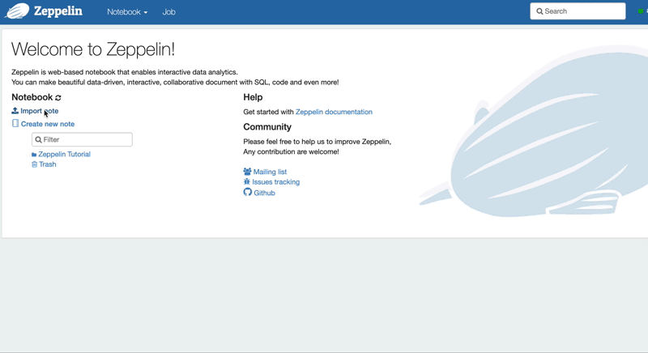
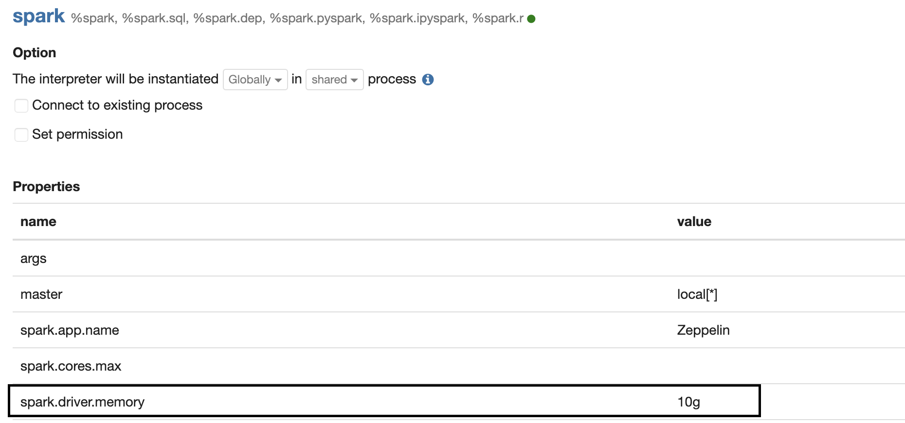

# 1. Setting for Zeppelin 

You can try LightningDB in Zeppelin notebook.

Firstly, deploy and start the cluster of LightningDB using [**fbctl**](command-line-interface.md) before launching Zeppelin daemon.

Secondly, in order to run LightingDB on the Spark, the jars in the LightingDB should be passed to the Spark.
This can be done by adjusting SPARK_SUBMIT_OPTIONS in zeppllin-env.sh

```bash
$ cp $ZEPPELIN_HOME/conf/zeppelin-env.sh.template $ZEPPELIN_HOME/conf/zeppelin-env.sh
$ vim $ZEPPELIN_HOME/conf/zeppelin-env.sh 

# /home/ec2-user/tsr2/cluster_1/tsr2-assembly-1.0.0-SNAPSHOT is a path in which LightningDB is installed using fbctl.
# This can be different if you installed LightningDB in different path.
export SPARK_SUBMIT_OPTIONS="--jars $(find /home/ec2-user/tsr2/cluster_1/tsr2-assembly-1.0.0-SNAPSHOT/lib -name 'tsr2*' -o -name 'spark-r2*' \
-o -name '*jedis*' -o -name 'commons*' -o -name 'jdeferred*' -o -name 'geospark*' \
-o -name 'gt-*' | tr '\n' ',')"
```

Finally, start Zeppelin daemon.

```bash
$ cd $ZEPPELIN_HOME/bin
$ ./zeppelin-daemon.sh start
```

# 2. Tutorial with Zeppelin

After starting zeppelin daemon, you can access zeppelin UI using browser. The url is [https://your-server-ip:8080](https://your-server-ip:8080).


There is [a github page for tutorial](https://github.com/mnms/tutorials).

The repository includes a tool for generating sample data and a notebook for tutorial.

You can import the tutorial notebook with its url.

https://raw.githubusercontent.com/mnms/tutorials/master/zeppelin-notebook/note.json



The tutorial runs on the spark interpreter of Zeppelin.
Please make sure that the memory of Spark driver is at least 10GB in Spark interpreter setting.


